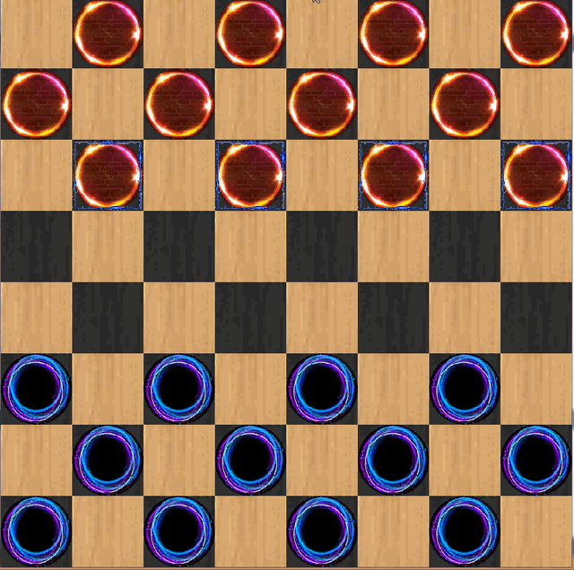

# English checker game
English checker game  using SFML library.

The can move one position  forward or backward.





---


## Build


### Windows 

- visual studio 2015 or newer
- extract SFML archive ($projectdir/sfml)
- build project

### Linux

- install SFML
```shell
$ sudo apt-get install libsfml-dev (debian based)
```
 

- build makefile
```shell
$ make
```


## Created by 
ibrahim khochmane


